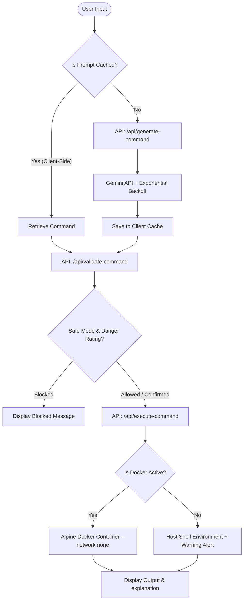

# Smart Shell AI 🖥️🤖

[](https://nextjs.org/)
[](https://ai.google.dev/)
[](https://www.typescriptlang.org/)
[](https://www.docker.com/)

A full-stack, AI-powered interactive web terminal that translates natural language prompts into precise, safe, and explainable shell commands.

Ever wanted to just type *"find all files larger than 100MB"* instead of searching for complex regex patterns in standard manuals? **Smart Shell AI** handles the translation, explains the safety profiles, and executes the results safely from a responsive, retro-themed glassmorphic web browser terminal.

---

## 🚀 Why I Built This (Engineering Context)

Smart Shell AI was built as a portfolio project to demonstrate practical solutions to complex, real-world full-stack problems:

1. **Security & Sandboxing:** Dynamically executing LLM-generated commands is highly risky. I engineered an isolation layer using localized Docker Alpine sandboxes (memory-capped, network-restricted) with an automated host shell fallback mechanism.
2. **API Rate-Limiting & Cost Optimization:** LLM calls can be slow and expensive. I designed a **dual-layer caching strategy** (persistent client-side storage + server-side in-memory mapping) paired with an **exponential backoff retry wrapper** to handle Gemini API rate limits (HTTP 429) gracefully.
3. **Optimized Production Packaging:** I structured a multi-stage Docker build pipeline leveraging Next.js standalone file-tracing to compress the runtime container size by over 80%.

---

## 🛠️ Architecture & Flow Diagram

The application leverages a unified Next.js App Router architecture. Below is the system flow showing how commands move from user input, get cached, validated, and sandboxed:



---

## 💡 Key Technical Highlights

### 1. Dual-Layer Caching & Rate-Limit Resilience
To protect against Google Gemini's API rate limits (such as the 15 RPM free-tier constraint) and eliminate redundant API costs:
* **Client-Side Cache:** Generated commands and explanations are mapped and saved in `localStorage`. Repeated searches return instantly with 0ms network latency.
* **Server-Side Cache:** Memory maps serve as a secondary cache for API routes during the same execution session.
* **Exponential Backoff:** If the Gemini API returns an HTTP 429 Rate Limit error, a wrapper automatically retries up to 3 times, doubling the delay between each attempt (1s -> 2s -> 4s).
* **Model Fallbacks:** Automatically attempts to fallback from `gemini-2.5-flash` to `gemini-1.5-flash` if the main engine reports setup/availability warnings in specific hosting regions.

### 2. Dual-Engine Command Execution
* **Docker Sandboxing (Preferred):** Commands run inside an Alpine container with strict limits:
  `docker run --rm --network none --memory 128m alpine sh -c "..."`
* **Local Host Fallback (Secondary):** If Docker is not installed or active in the deployment environment (e.g. serverless Vercel or a basic VPS), the backend detects it and falls back to executing commands directly on the host shell.
* **Active Status Warning:** The UI displays a live header badge (`Docker Sandboxed` vs `Local Host`) and injects a warning marker in the logs whenever fallback execution is active.

### 3. Built-in Safety Modes
* **Safe Mode:** Instantly checks commands against deterministic RegEx pattern checks (fork bombs, `rm -rf /`, raw disk formatters) and halts execution before any VM action is taken.
* **Learning Mode:** Shows step-by-step AI breakdowns explaining parameters and flags before requesting confirmation.
* **Power Mode:** Executes safe commands immediately, requesting confirmation only for suspicious commands.

---

## 💻 Tech Stack

* **Frontend:** Next.js 14 (App Router), React 18, Tailwind CSS, Lucide icons.
* **Backend:** Next.js Route Handlers (Serverless-ready).
* **AI Engine:** `@google/genai` (Google Gemini SDK).
* **Isolation:** Native Docker Engine / Node `child_process`.

---

## 🛠️ Local Setup & Configuration

### Prerequisites
1. **Node.js** (v18.x or v20.x recommended)
2. **Docker Desktop** (optional, recommended for sandbox security)
3. **Google Gemini API Key** (available at [Google AI Studio](https://aistudio.google.com/))

### 1. Install Dependencies
```bash
npm install
```

### 2. Configure Environment Variables
Create a `.env.local` file in the root folder:
```env
GEMINI_API_KEY=your_gemini_api_key_here
GEMINI_MODEL=gemini-2.5-flash
```

### 3. Run Development Server
```bash
npm run dev
```
Open [http://localhost:3000](http://localhost:3000) to view the terminal UI.

---

## 🌐 Production Deployment Guides

### Option A: Serverless Deployment (Vercel)
You can deploy this Next.js project to Vercel with a single click:
1. Push your repository to GitHub.
2. Link the repository to your Vercel Dashboard.
3. Configure the environment variables (`GEMINI_API_KEY` and optional `GEMINI_MODEL`).
4. Click **Deploy**.
> **Note on Vercel:** Since Vercel runs Serverless Functions, Docker will not be active. The app will automatically run commands inside its own serverless runtime container and display the `Local Host` status warning.

### Option B: Containerized Deployment (Railway / Render / Fly.io)
This project includes a multi-stage, production-ready `Dockerfile` optimized using Next.js standalone outputs.

1. **Standalone Config:** The project is configured with `output: 'standalone'` in `next.config.mjs`.
2. **Docker Build:**
   ```bash
   docker build -t smart-shell-ai .
   ```
3. **Docker Run:**
   To run the container and mount your local Docker daemon socket (allowing the app container to spawn nested sandbox containers):
   ```bash
   docker run -p 3000:3000 \
     -v /var/run/docker.sock:/var/run/docker.sock \
     -e GEMINI_API_KEY="your_api_key" \
     smart-shell-ai
   ```
   *If you do not mount `/var/run/docker.sock`, the container will run commands directly inside its own internal Alpine context (which is already isolated from your real host machine!).*
